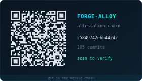

# ForgeAlloy — Universal Attestation Chain

<div align="center">
  <a href="https://cambriantech.github.io/forge-alloy/verify/#09b8df836920c4be">
    
  </a>
  <br>
  <sub>This repo eats its own dogfood — scan to verify its attestation chain. Git IS the Merkle chain.</sub>
</div>

> *"Zero-trust is the only path to absolute trust, proven by mathematics alone. A Merkle chain for any series of transactions — each stage cryptographically and deterministically secured — allows even AI to be part of that chain. Deepfakes and misinformation become impossible."*

A **domain-agnostic chain of custody** for any data transformation. Each link in the chain is signed, hashed, and verifiable by anyone — no trusted server, no central authority. The math is the authority.

**The fundamental principle: attested Merkle chains are the contract amongst any node.** Not a legal contract argued by lawyers. Not a smart contract requiring a blockchain network. The chain itself is a self-verifying bilateral agreement — "I attest that I did X to this data; you verify that I did X; if the chain breaks, the contract is violated." Works between two cameras, a GPU and its operator, an airplane and Boeing, a medical device and its manufacturer, two grid nodes sharing compute, a developer and every user running their code. The nodes don't matter. The math is the universal primitive.

Built for AI model forging. Extends to any domain: datasets, adapters, compute receipts, grid transactions, package delivery, document signing — anything where you need to prove who did what to which data.

A `.alloy.json` is a **Dockerfile for models** AND a **shipping manifest** AND a **signed receipt**. It's the recipe (before), the report card (after), and the cryptographic proof (always). Verify it client-side, offline, with no network. Scan a QR code and see the entire chain.

### Core Concepts

| Concept | What It Is |
|---------|-----------|
| **Alloy** | A chain of signed transformations on hashed data |
| **Stage** | One link in the chain: input hash → transformation → output hash → signature |
| **Domain** | A family of stage types (LLM, vision, audio, compute, delivery — extensible) |
| **Chain** | Each stage's output hash = next stage's input hash. Walk backwards to verify. |
| **Attestation** | Cryptographic proof: who ran what, on which hardware, with which code |
| **Verification** | Client-side. Recompute hashes, verify signatures. No trusted server. |
| **QR Code** | Self-contained proof — scan to verify the entire chain offline |
| **Delivery** | Final stage — hand off to recipient. Never automatic without review. |

### The Chain

```
[Source] ──hash──► [Stage 1] ──hash──► [Stage 2] ──hash──► [Delivery]
   │                  │                    │                    │
 signed             signed               signed              signed
```

Each link: `prev_hash` + `input_hash` + `stage_config` + `output_hash` + `signature`. Break any link → chain invalid. Verify any link → follow `prev` to origin.

### Type Byte (domain classification)

```
0x01  Model forge       Prune, train, quant — AI model transformation
0x02  Adapter training   LoRA, skill acquisition
0x03  Dataset            Provenance of training data
0x04  Compute receipt    Grid transaction, GPU-hours
0x05  Delivery           Model published/deployed
0x06  Evaluation         Benchmark scores, quality gates
0x07  Vision encoder     Modality addition (CLIP, SigLIP)
0x08  Audio encoder      Modality addition (Whisper)
0xFF  Custom domain      Schema in payload
```

### Verification (no trusted server)

```bash
forge-alloy verify model.alloy.json --model-dir ./weights/
# Recomputes hashes, verifies signatures, walks chain — all local, no network
```

In browser: client-side JS does the same. The verification page is a convenience — the math runs locally.

## The Model Compiler

**`gcc` turns C into binaries. forge-alloy turns neural networks into models that run on YOUR hardware.**

A recipe is source code. The search algorithm is the optimizer. The benchmark is the test suite. The GGUF is the compiled binary. The attestation is the build manifest. This isn't a metaphor — it's the same architecture:

- **Dead code elimination** = dead expert elimination (remove experts that don't activate)
- **Profile-guided optimization** = calibration-aware pruning (profile on a corpus, optimize hot paths)
- **Target architecture** = your GPU (32GB, 24GB, 16GB — the compiler fits the binary to your hardware)
- **Optimization level** = search strategy (binary search, RANSAC, adaptive per-layer)
- **Link-time optimization** = compensation LoRA (post-prune quality recovery)

The search finds the optimal model FAST — size filter (instant) → quality estimate (instant) → quick eval (2 min, ±0.4) → full eval (40 min, ±0.09). Only the winner gets the expensive eval. 95% of candidates die for free.

```
forge mixtral-8x22b-coding {
    source: "mistralai/Mixtral-8x22B-Instruct-v0.1"
    target {
        devices: [rtx-5090-32gb]
        domain: coding
        benchmark: humaneval >= 0.65
    }
    search: auto
}
```

You specify WHAT you want. The compiler finds HOW. One command, optimal model, attested, published. See [MODEL-COMPILER.md](docs/MODEL-COMPILER.md) for the full architecture.

## Quick Example

```json
{
  "name": "qwen3.5-4b-code-balanced",
  "version": "1.0.0",
  "source": { "baseModel": "Qwen/Qwen3.5-4B", "architecture": "qwen3_5" },
  "stages": [
    { "type": "prune", "strategy": "entropy", "level": 0.3 },
    { "type": "train", "domain": "code", "steps": 1000, "learningRate": "2e-4" },
    { "type": "quant", "format": "gguf", "quantTypes": ["Q4_K_M"] },
    { "type": "eval", "benchmarks": [{ "name": "humaneval" }] },
    { "type": "publish", "org": "continuum-ai" }
  ],
  "cycles": 3
}
```

After execution, the same file gains a `results` section with benchmark scores, hardware performance profiles, generation samples, and an integrity attestation — everything needed to generate a high-quality model card.

## Packages

| Package | Language | Source of Truth |
|---------|----------|----------------|
| `forge-alloy` | Rust | **Yes** — all types originate here |
| `forge-alloy` | Python | Generated from Rust (Pydantic models) |
| `@continuum-ai/forge-alloy` | TypeScript | Generated from Rust (ts-rs) |

## Stage Types

Every alloy pipeline is a sequence of **stages** organized into three phases:

```
INPUT (configure) → TRANSFORM (modify the model) → DELIVERY (verify + ship)
```

Stages are **domain-extensible**. The core contract defines the phase structure. Each domain (LLM, vision, audio, diffusion) registers its own stage types. The executor, attestation, and pipeline runner are domain-agnostic.

### Generic Pipeline Structure

| Phase | Purpose | Examples (any domain) |
|-------|---------|----------------------|
| **Input** | Configure source model, capabilities, targets | source-config, context-extend, modality |
| **Transform** | Modify model weights, architecture, behavior | prune, train, lora, compact, adapt |
| **Delivery** | Verify quality, package, ship to destination | eval, quant, package, deliver |

**Delivery is never automatic.** The alloy defines what CAN be delivered and where. Actual delivery requires explicit approval — the forge produces artifacts and evidence, a human (or authorized agent) reviews and approves.

### LLM Domain (built-in)

| Stage | Phase | What It Does |
|-------|-------|-------------|
| `source-config` | input | Context window, modalities, target devices |
| `context-extend` | input | RoPE rescaling (YaRN, NTK) for longer context |
| `modality` | input | Add vision/audio encoder (LLaVA-style, Whisper-style) |
| `prune` | transform | Head pruning (entropy, magnitude, gradient) |
| `train` | transform | Recovery/fine-tuning with full training config |
| `lora` | transform | LoRA adapter training (QLoRA, rank, alpha, dropout) |
| `compact` | transform | Plasticity-based mixed-precision compaction |
| `recover` | transform | Post-surgery weight recovery (analytical, RANSAC, ML meta-learner) |
| `expert-prune` | transform | MoE expert pruning by activation profile |
| `quant` | delivery | Output quantization (GGUF, MLX, ONNX, safetensors) |
| `eval` | delivery | Benchmarking (HumanEval, MMLU, GSM8K, custom) |
| `publish` | delivery | Push to HuggingFace with generated model card |
| `deploy` | delivery | Deploy to grid node for serving |

### Other Domains

The same pipeline structure applies to any model domain:

| Domain | Input | Transform | Delivery |
|--------|-------|-----------|----------|
| **Vision** | source-config, calibrate | augment, backbone-swap, detection-head | eval (mAP, IoU), package (CoreML, TensorRT) |
| **Diffusion** | source-config | unet-prune, scheduler-swap, vae-tune | eval (FID, CLIP), package |
| **Audio** | source-config | codec-swap, speaker-adapt, denoise | eval (WER, MOS), package |
| **Robotics** | source-config, sim-config | sim-to-real, policy-distill, safety-bound | eval (success rate), deploy |

Each domain defines its own stage configs, executors, and benchmarks. The alloy contract and attestation are universal. See [#7](https://github.com/CambrianTech/forge-alloy/issues/7) for the domain extension roadmap.

## Results & Benchmarks

After execution, the alloy carries its own evidence:

```json
{
  "results": {
    "baselinePerplexity": 3.04,
    "finalPerplexity": 2.31,
    "improvementPct": 24.0,
    "benchmarks": [
      {
        "name": "humaneval",
        "metrics": { "passing": 63, "total": 85, "score": 74.1 }
      }
    ],
    "hardwareVerified": [
      { "device": "iPhone 17", "format": "Q4_K_M", "sizeGb": 2.6, "tokensPerSec": 8.0, "verified": true },
      { "device": "RTX 5090", "format": "fp16", "sizeGb": 8.0, "tokensPerSec": 174.0, "verified": true }
    ],
    "samples": [
      { "label": "Merge Sort", "prompt": "def merge_sort(arr):", "completion": "..." }
    ]
  }
}
```

Benchmark metrics are **open-ended** — each benchmark reports whatever it wants. HumanEval has `passing`/`total`/`score`. MMLU has `accuracy`/`nShot`. IMO-ProofBench has `proofScore`/`difficulty`. The format doesn't constrain what benchmarks can express.

## Integrity Attestation

Modeled after **FIDO2/WebAuthn attestation**. Proves what code ran, on what data, in what environment — and signs the whole chain with ES256 (ECDSA P-256).

```json
{
  "results": {
    "integrity": {
      "trustLevel": "self-attested",
      "code": {
        "runner": "sentinel-ai/forge_model",
        "version": "0.9.2",
        "binaryHash": "sha256:a1b2c3...",
        "commit": "09bb60f"
      },
      "modelHash": "sha256:7f8a9b...",
      "datasets": [
        { "name": "humaneval", "hash": "sha256:abc123...", "source": "https://github.com/openai/human-eval" }
      ],
      "signature": {
        "algorithm": "ES256",
        "publicKey": "MFkwEwYHKoZIzj0CAQYIKoZIzj0DAQcDQgAE...",
        "value": "MEUCIQD...",
        "keyRegistry": "https://keys.forge-alloy.dev/v1"
      },
      "attestedAt": "2026-03-28T14:32:00Z"
    }
  }
}
```

**Trust tiers** (like WebAuthn attestation types):

| Tier | What It Proves | Verification |
|------|---------------|-------------|
| `self-attested` | Signer vouches for itself | Public key in registry |
| `verified` | Third-party audited the runner | Certificate chain |
| `enclave` | TEE execution, hardware-bound proof | Hardware attestation |

**What it prevents:** fabricated benchmarks, modified eval code, cherry-picked datasets, model swaps, replay attacks. See [docs/ATTESTATION.md](docs/ATTESTATION.md) for the full design.

## Usage

### Rust

```rust
use forge_alloy::{ForgeAlloy, AlloyStage};

let alloy = ForgeAlloy::from_file("my-alloy.json")?;
alloy.validate()?;

if alloy.has_results() {
    println!("Trust: {:?}", alloy.trust_level());
    println!("Signed: {}", alloy.is_signed());
}

for stage in &alloy.stages {
    match stage {
        AlloyStage::Prune(p) => println!("Pruning {}%", p.level * 100.0),
        AlloyStage::Train(t) => println!("Training {} steps", t.steps),
        _ => {}
    }
}
```

### Python

```python
from forge_alloy import ForgeAlloy

alloy = ForgeAlloy.from_file("my-alloy.json")
errors = alloy.validate_alloy()

if alloy.has_results:
    print(f"Trust: {alloy.trust_level}")
    for b in alloy.results.benchmarks:
        print(f"  {b.name}: {b.metrics}")
```

### TypeScript

```typescript
import { ForgeAlloy, validateAlloy, isSigned, trustLevel } from '@continuum-ai/forge-alloy';

const alloy: ForgeAlloy = JSON.parse(fs.readFileSync('alloy.json', 'utf-8'));
const errors = validateAlloy(alloy);

if (alloy.results) {
  console.log(`Trust: ${trustLevel(alloy)}, Signed: ${isSigned(alloy)}`);
}
```

## Schema

The complete JSON Schema is at [`schema/forge-alloy.schema.json`](schema/forge-alloy.schema.json).

## Examples

- [`qwen3.5-4b-code-balanced.alloy.json`](examples/qwen3.5-4b-code-balanced.alloy.json) — Recipe (before execution)
- [`qwen3.5-4b-code-balanced-executed.alloy.json`](examples/qwen3.5-4b-code-balanced-executed.alloy.json) — Executed (with results, benchmarks, hardware profiles, attestation)
- [`qwen3.5-4b-multimodal-code.alloy.json`](examples/qwen3.5-4b-multimodal-code.alloy.json) — Full pipeline: source-config → vision → context → prune → train → quant → eval → publish → deploy

## Case Studies — The Alloy Pattern Applied

The same Merkle-chained, cryptographically secured workflow handles any process that needs provenance and trust. We're using it NOW between [continuum](https://github.com/CambrianTech/continuum) and [sentinel-ai](https://github.com/CambrianTech/sentinel-ai) for model forging. The pattern is universal.

### AI Model Forging (In Production)

We forge models on consumer GPUs and publish to HuggingFace with full chain of custody. Every claim on the model card is backed by the alloy.

```
Introspect Qwen3.5-4B → delta: add code domain + GGUF quant
  → forge (3 cycles on RTX 5090) → attest (code hash + model hash)
  → eval (HumanEval 74.1%) → publish (HF + alloy file + QR)
```

**Result**: 15,000+ downloads across 13 published models. Every model carries its alloy. Anyone can verify the forge, reproduce the pipeline, or re-forge with modifications.

### Content Authenticity (Deepfake Prevention)

Camera with hardware enclave signs the raw image at capture. Every edit is a tracked delta. The Merkle chain proves what's real and what's modified.

```
Capture (Canon R5, enclave-signed)          → sha256:abc  ← root of trust
  ↓
Crop + levels (Photoshop CC via API)        → sha256:def  ← delta: crop(10,20,800,600)
  ↓
Publish to Twitter                          → sha256:def  ← unmodified since edit
```

**Scan QR → full edit history.** AI generated? Chain starts with a generation model, not a camera enclave. Altered? Every edit listed with exact parameters and tool. Unaltered? Camera hash matches published hash. No chain = no trust.

Steganographic embedding puts the alloy hash invisibly in the image itself. Even if the QR is cropped, the proof survives.

### Physical Manufacturing (Etsy, Supply Chain)

A producer's workflow from design through delivery, verified end to end:

```
Design (ring-v3.stl, silver)                → sha256:abc
  ↓
3D Print (Formlabs, 80% infill)             → sha256:def  ← attested by printer
  ↓
Quality check (weight: 12.3g, 4 photos)     → sha256:ghi
  ↓
Publish (Etsy + Shopify)                    → sha256:jkl
  ↓
Ship (USPS 9400..., GPS cold chain)         → sha256:mno
```

**QR on the package.** Buyer scans → sees full provenance. Photos match product. Manufacturing specs recorded. Returns traceable. Trust without trusting the seller.

### Pharmaceutical / Regulated Manufacturing

FDA-grade batch records as alloy contracts:

```
Compound (lot numbers, raw materials)       → sha256:abc  ← facility-attested
  ↓
Synthesize (reactor: 180°C, 4hr, yield 94%) → sha256:def
  ↓
Quality test (purity 99.7%)                 → sha256:ghi  ← enclave-attested lab
  ↓
Package (lot XY-2026-0331, exp 2028-03)     → sha256:jkl
  ↓
Distribute (cold chain verified)            → sha256:mno
```

**FDA audit = verify the chain.** Every step attested. Every parameter recorded. The alloy IS the batch record.

### Creative IP (Music, Film, Software)

Prove who created what, when, with what tools:

```
Record (studio, 24-bit/96kHz, 3 musicians)  → sha256:abc  ← hardware-attested interface
  ↓
Mix (Pro Tools, 47 tracks)                  → sha256:def
  ↓
Master (LUFS -14, true peak -1dB)           → sha256:ghi
  ↓
Publish (Spotify + Apple + Bandcamp)        → sha256:jkl
```

**Copyright dispute?** The chain resolves it. Who recorded what, when, mixed by whom, mastered to what spec. Timestamped and signed.

### Automotive / Robotics (Every Part Attested)

Every component, every firmware, every calibration — in the chain:

```
Brake pad:   supplier X, batch 2026-03, friction 0.41    → sha256:abc
ECU firmware: v3.2.1, compiled commit def, tests passed  → sha256:def
Servo motor: calibrated 0.01° accuracy, temp profile OK  → sha256:ghi
```

**Part fails → walk the chain → find every other instance.** Supplier X's brake batch → which other cars got it → recall JUST those. A robot arm drifts → which servo, which firmware, which calibration → fix propagates to every robot with the same config.

The chain doesn't just track failures — it tracks TRENDS. Friction trending down over 6 months? Catch it BEFORE the failure. That's predictive maintenance from attestation data. Parts not yet in the chain get flagged for migration. Every uncovered component is visible technical debt.

### The Economics of Attested Quality

Attestation creates a new kind of market. Suppliers compete on PROVABLE quality, not CLAIMED quality. You don't trust the brochure — you verify the hash.

```
Supplier A: "Our brake pads are the best!"    → no chain → no trust
Supplier B: friction=0.42, 10K cycle test,    → sha256:abc → verified
            3 independent lab attestations
```

Bad actors can't hide behind marketing when every claim has a hash. The market selects for actual quality because quality is cryptographically provable. Honest error is acceptable — the chain shows what happened and why. Deception is impossible — the chain exposes it.

This extends to AI itself. A model card says "pass@1 = 74%." Is that real? With forge-alloy: the eval dataset has a hash, the eval code has a commit hash, the result samples have a hash. Anyone can reproduce, verify, challenge. **AI quality becomes auditable by anyone, not just the company that trained it.**

A photo says "unedited." Is that real? With forge-alloy: the camera enclave signed the raw capture. Every edit is a delta with exact parameters. AI-generated content starts with a model hash, not a camera hash. **Media authenticity becomes a checkbox, not a debate.** An AI can provide a simple confidence score: "95% likely authentic — camera enclave chain intact, no generative model in provenance."

### Attestation Coverage Score — What the QR Tells You

When you scan the QR on a model card, a product, or a photo, you don't just see "verified." You see a **coverage score** — how much of the chain is attested, and where the gaps are.

```
┌─────────────────────────────────────────────┐
│  Mixtral 8x22B Compacted                    │
│  Coverage: ████████░░ 80%                   │
│                                              │
│  ✅ Source model (hash verified)             │
│  ✅ Calibration corpus (hash verified)       │
│  ✅ Profiling (148K tokens, hash verified)   │
│  ✅ Expert pruning (28 shards, all hashed)   │
│  ⚠️ Quantization (self-attested, no enclave)│
│  ✅ Perplexity eval (PPL 8.18 ± 0.24)       │
│  ❌ HumanEval (not yet run)                 │
│  ❌ Inference verification (not yet tested)  │
│                                              │
│  Trust: self-attested │ 6/8 stages covered  │
└─────────────────────────────────────────────┘
```

**The gaps ARE the rating.** 80% coverage means 20% is unverified. Each uncovered stage is a known weakness — either untested (HumanEval not run) or unattested (quantization without hardware enclave). The coverage score rates the product by what's PROVEN, not what's CLAIMED.

**For defenders:** the gaps tell you where to invest. Run HumanEval → coverage goes to 87%. Add enclave attestation to quantization → 100%. Each improvement is visible immediately in the score.

**For adversaries:** the gaps tell you where to attack. An un-attested quantization stage is where you'd inject a backdoored GGUF. An un-tested inference path is where subtle model corruption hides. The chain's gaps are the threat map.

**For consumers:** the score is a simple trust signal. Two models on HuggingFace — one at 95% coverage, one at 40%. Which do you download? The coverage score makes quality VISIBLE without understanding cryptography.

The QR code on every model card, every product, every photo resolves to this coverage view. Scan → see what's proven, what's missing, what's the risk. Trust becomes a number, not a feeling.

### The Common Pattern

Every case follows the same structure. Different stage types, same infrastructure:

```
Source → Delta → Stages → Attest → Deliver → Verify (QR)
```

The Merkle chain secures it. The attestation proves it. The QR makes it accessible. The coverage score rates it.

### Actionable Chains — Bug Routing + Supply Chain Accountability

Each stage in the chain has an **owner**, an **issue tracker**, and a **fix path**. When something breaks, walk the chain to find who's responsible:

```
User: "This model generates bad Python"
  → Scan QR → walk chain
  → HumanEval stage: ❌ NOT RUN
  → Owner: forge-operator
  → Fix: run eval_runners/humaneval.py (30 min)
  → File issue: github.com/CambrianTech/sentinel-ai/issues
```

The chain routes bugs to the RIGHT owner. Not "email support and wait." Find the stage, find the owner, file directly.

**API for programmatic access:**

```
GET /api/v1/alloy/{hash}/coverage → { score: 0.80, stages: [...] }
GET /api/v1/alloy/{hash}/stage/{name}/owner → { owner, issueTracker, fixCommand }
POST /api/v1/alloy/{hash}/stage/{name}/report → file issue to stage owner
```

**Software supply chain protection.** The Axios hack affected 40% of npm projects because dependencies are trusted blindly. With forge-alloy on the dependency chain:

```
your-app
  └─ axios@1.7.2  ← attested: hash=abc, npm audit=clean, 
                     maintainer=verified, no post-install scripts
      └─ follow-redirects@1.15.6  ← ⚠️ coverage: 40%
                                      post-install script: YES
                                      maintainer: single individual
                                      last security audit: 8 months ago
                                      
Coverage score surfaces the risk BEFORE the hack.
```

Every dependency carries its attestation. Coverage gaps in deep dependencies bubble up to YOUR score. A dependency with low coverage lowers YOUR product's trust. The market pressure flows backward through the chain — maintain your attestation or downstream consumers drop you.

This works across repos, across organizations, across the entire open source ecosystem. Each repo attests its own stage. The chain connects them. A vulnerability in ANY stage is visible to EVERYONE downstream. No more "we didn't know our dependency was compromised." **The chain told you. The coverage score showed the gap. The API gave you the owner to notify.**

### Live CVE Propagation — The Chain as a Notification Bus

Today when a CVE drops, the process is: NVD publishes → scanner crawls → advisory email sent → human reads it → human decides what to do → manual patch cycle. Weeks pass. Millions of devices remain exposed.

With forge-alloy on the chain, the alloy IS the subscription. Every device running attested software already has the chain. When a stage is compromised:

```
CVE-2026-XXXX published for follow-redirects@1.15.6
  │
  ├─ Attestation service marks stage as COMPROMISED
  │    └─ coverage score: 40% → 0% (chain broken)
  │
  ├─ Every downstream alloy that includes this stage:
  │    ├─ App store: flags app for review, warns users at install
  │    ├─ Device: OS-level notification to user's AI assistant
  │    └─ Running app: runtime check detects broken chain
  │
  └─ Device-local AI receives CVE context:
       ├─ What the exploit does (code execution via redirect manipulation)
       ├─ What user behavior triggers it (clicking redirected links)
       ├─ Risk-adjusted recommendation based on user profile:
       │    ├─ Casual user: "Update when convenient, avoid financial sites"
       │    ├─ Technical user (banking/security): "Here's what the exploit
       │    │    does mechanically — redirect manipulation allows code execution.
       │    │    You can still use the app safely if you avoid clicking links
       │    │    within it. The vulnerability only triggers on HTTP 3xx chains."
       │    ├─ High-value target: "Stop using this app until patched"
       │    └─ Security professional: "Here's the exploit path, mitigate at proxy"
       └─ Automated action (if user authorizes): disable affected feature
```

**The key insight:** the device already has the attestation chain. It already knows every dependency, every stage owner, every coverage score. When a CVE fires, the device doesn't need a scanner — it has the bill of materials. The chain IS the SBOM (Software Bill of Materials), and it's already verified.

**For high-value targets** — banking, security applications, critical infrastructure — the device AI becomes a real-time security advisor. Not a dumb "update your app" notification. The AI understands both the exploit's mechanics and the user's technical literacy:

```
User's AI: "The redirect library in your banking app has a code execution 
vulnerability (CVE-2026-XXXX). The exploit works by chaining HTTP 3xx 
redirects to inject code during the redirect handler. I've disabled 
automatic redirects in that app. You can still use it safely for account 
viewing and transfers — just don't click any links within the app itself. 
The vulnerability only triggers on redirect chains, not direct API calls. 
The fix is in review — ETA 48 hours based on the maintainer's patch 
history. Want me to notify you when the patched version ships?"
```

The user who understands the engineering can make an informed risk decision — continue using the app while avoiding the specific behavior that triggers the exploit, rather than losing access entirely. The user who doesn't understand can get the simpler "avoid this app" version. **The AI mediates between a raw CVE and human behavior at the right level of abstraction for each user.**

This isn't theoretical — it's what happens when you combine:
1. **Attestation chains** that already map every dependency
2. **Coverage scores** that already quantify trust gaps
3. **Stage owner routing** that already knows who to notify
4. **Device-local AI** that already understands the user's risk profile

The chain doesn't just prove the past. It **protects the future.** Every CVE becomes immediately actionable at every point in the graph — from the app store to the device to the user's AI to the stage owner who needs to patch.

**API extensions for live CVE propagation:**

```
POST /api/v1/stage/{hash}/compromise     → mark stage as compromised (CVE issuer)
GET  /api/v1/alloy/{hash}/health         → live chain health (are all stages clean?)
WS   /api/v1/alloy/{hash}/subscribe      → real-time CVE notifications for this chain
GET  /api/v1/alloy/{hash}/mitigations    → risk-adjusted actions for affected users
```

### Safety-Critical Systems — When CVE Propagation Saves Lives

Software supply chain attacks are annoying in consumer apps. In safety-critical systems they kill people.

**Boeing 737 MAX MCAS** — the case study that makes this concrete:

```
October 2018: Lion Air 610 crashes. 189 dead.
  Investigation reveals: MCAS software trusts a SINGLE angle-of-attack 
  sensor. Sensor disagrees with its pair by >10°. MCAS pushes nose down.
  Pilots can't override. Aircraft hits water.

March 2019: Ethiopian Airlines 302 crashes. 157 dead. Same root cause.
  5 MONTHS between crashes. Every 737 MAX in service had the same 
  vulnerability the entire time. The FAA grounded the fleet AFTER 
  the second crash. 157 people died waiting for bureaucracy.
```

With attestation-chain CVE propagation on the MCAS software:

```
October 2018: Lion Air 610 crashes.
  │
  ├─ Investigation flags MCAS single-AoA-sensor dependency
  │    └─ CVE issued for MCAS attestation stage
  │
  ├─ Every 737 MAX in service receives the CVE in milliseconds:
  │    └─ Aircraft AI knows the exact tolerances:
  │         "MCAS trusts single AoA sensor. If sensors disagree 
  │          by >10°, MCAS will command nose-down trim."
  │
  ├─ Aircraft AI applies mitigation:
  │    ├─ Alerts crew: "MCAS authority limited — AoA sensor 
  │    │   disagreement detected, manual trim recommended"
  │    ├─ Reduces MCAS trim authority automatically
  │    └─ Logs the mitigation for maintenance review
  │
  └─ Ethiopian Airlines 302 (March 2019):
       Aircraft AI already knows about the MCAS vulnerability.
       Crew is alerted. MCAS authority is limited.
       157 people go home to their families.
```

This isn't hypothetical engineering. The attestation chain already maps every software component. The CVE propagation already reaches every device. The AI already understands the tolerances. **The only missing piece is having the chain in place.** The technology exists — the 737 MAX fleet just didn't have it.

The same pattern applies to:
- **Automotive recalls** — Tesla OTA vs traditional mail-a-letter recalls. But even Tesla's OTA is push-from-manufacturer, not pull-from-chain. Attestation makes every vehicle aware of every vulnerability in every component, from any vendor, instantly.
- **Medical devices** — pacemakers, insulin pumps, infusion pumps. The device AI knows its own tolerances and can adjust behavior within safe limits while a patch ships.
- **Industrial control** — SCADA systems, power grid controllers, water treatment. The Stuxnet attack exploited software that had no attestation chain. With one, the centrifuges would have known their firmware was compromised before it spun them apart.

**The economics:** app stores that verify attestation chains can offer "attested" badges. Insurance underwriters can price cyber risk based on coverage scores. The incentive structure rewards maintaining attestation — not just at publish time, but continuously. Break your chain, lose your badge, lose your insurance rate, lose your users. The market enforces security without regulation.

[Full applications doc →](docs/APPLICATIONS.md)

## Hardware Trust Integration

Every device that touches the chain can prove its involvement. The trust ladder goes from "take my word for it" to "silicon proves it":

### The Trust Ladder

| Level | Authority | How It Proves | What It Stops |
|-------|-----------|--------------|---------------|
| **Git commit** | Repository | Commit hash = Merkle root | Code tampering |
| **Passkey (FIDO2)** | Device Secure Enclave | Hardware-bound keypair, non-exportable | Identity theft, shared credentials, North Korean fake employees |
| **Device enclave** | TPM / Secure Enclave | Platform attestation report | Device spoofing, VM-based attacks |
| **GPU TEE** | NVIDIA SEC2 silicon | Hardware attestation with serial number | Forge result tampering, fake benchmarks |
| **Continuous attestation** | Biometric + behavioral | Ongoing verification throughout session | Session hijacking, credential handoff |
| **Location attestation** | GPS + network proof | Geolocation bound to session | VPN masking, remote impersonation |

Each level makes impersonation harder:

```
Password:                 → shared trivially (North Korean teams do this)
SSH key:                  → copied to their servers
FIDO2 passkey:            → can't export from hardware
Passkey + device enclave: → can't fake the device
Passkey + enclave + GPS:  → can't fake the location
Full continuous chain:    → can't fake anything, checked continuously
```

### NVIDIA GPU Enclaves — Hardware-Attested Compute

NVIDIA's Blackwell/Hopper GPUs have TEE-I/O with SEC2 security components. Each GPU has a unique serial number and can generate hardware attestation reports via NRAS (NVIDIA Remote Attestation Service). This means:

```
Forge runs on GPU serial: NV-5090-0x7F3A2B
  → GPU generates attestation: "I computed this result"
  → Attestation includes: serial number, driver version, 
     firmware hash, compute configuration
  → Signed by NVIDIA's certificate chain
  → Verifiable by ANYONE without trusting the forge operator

The forge operator can't lie about what hardware ran the forge.
The GPU itself vouches for the computation.
```

This is NVIDIA's "factory of the future" vision — every computation attested by silicon, traceable to a specific physical GPU. forge-alloy integrates this natively:

```json
{
  "integrity": {
    "trustLevel": "enclave",
    "code": { "runner": "sentinel-ai", "commit": "abc123" },
    "hardware": {
      "gpu": "NVIDIA GeForce RTX 5090",
      "serial": "NV-5090-0x7F3A2B",
      "attestationReport": "base64:...",
      "nrasVerified": true
    },
    "signature": {
      "algorithm": "ES256",
      "certificateChain": ["nvidia-root-ca", "gpu-attestation-cert", "..."]
    }
  }
}
```

| Without GPU enclave | With GPU enclave |
|---|---|
| "We ran this on an RTX 5090" → trust us | The RTX 5090 serial NV-0x7F3A SIGNED this result → verify the cert chain |
| Operator could lie about hardware | Hardware can't lie about itself |
| Benchmarks could be fabricated | Benchmarks are silicon-attested |
| "PPL 8.18" → maybe | "PPL 8.18" → GPU proves it computed this |

The trust level upgrades from `self-attested` (take my word) to `enclave` (silicon proves it). The coverage score jumps. The model card goes from "trust the publisher" to "trust the math + the silicon."

This connects the entire chain: **FIDO2 passkey** proves the developer → **git commit** proves the code → **GPU enclave** proves the computation → **attestation chain** connects them all → **QR code** makes it scannable → **coverage score** makes it understandable.

### Additional Enclave Types

| Level | Authority | How It Proves | Use In Chain |
|-------|-----------|--------------|--------------|
| **Cloud Enclave** | AWS Nitro / Azure SGX | Isolated execution environment. Hypervisor cannot read enclave memory. | Nitro attestation document in `anchor` |
| **Mobile Enclave** | Apple / Android | Secure Enclave (iPhone/Mac) or StrongBox (Android). Biometric-gated signing. | Touch ID / Face ID protects forge signing key |
| **Sensor** | Camera / microphone / IoT | Hardware-signed capture at the source. Proves content was captured, not generated. | Camera enclave signs raw image → root of trust for content authenticity |

### Repository Binding (Phase 1 — Now)

GitHub is the certificate authority. No additional crypto needed.

```json
{
  "code": {
    "runner": "sentinel-ai/alloy_executor",
    "commit": "abc123def",
    "sourceRepo": "https://github.com/CambrianTech/sentinel-ai",
    "binaryHash": "sha256:..."
  }
}
```

Verification: hash the file at `sourceRepo/blob/commit/script.py`, compare to `binaryHash`. If they match, the code that ran is the code on GitHub. If not, something was modified.

### Passkey Signing (Phase 2)

The forge runner's device signs the attestation with a hardware-bound key:

- **macOS/iOS**: Apple Secure Enclave via `SecKeyCreateSignature` — Touch ID protected, non-exportable
- **Android**: KeyStore with `setIsStrongBoxBacked(true)` — hardware-bound ES256
- **Windows**: TPM 2.0 via `NCryptSignHash` — platform-bound signing

The key never leaves the device. The signature proves *this specific machine* forged *this specific model*. Same primitive as FIDO2 passkeys — different ceremony, same hardware.

### GPU TEE (Phase 4 — Required for Marketplace)

NVIDIA Blackwell architecture has TEE silicon. The GPU itself attests what code ran:

```
Forge runner loads into GPU TEE
  → GPU firmware hash recorded (environmentHash)
  → NVIDIA Attestation Service (NRAS) issues remote attestation
  → SEC2 security component generates hardware report
  → certificateChain carries NVIDIA's attestation certificate
  → Model weights hashed inside TEE before leaving enclave
```

This is the only tier where **every claim is hardware-proven**. The GPU can't lie about what code ran. The model hash is captured inside the enclave before the weights touch untrusted memory. Input-to-output binding is cryptographically guaranteed.

**Supported hardware:**
- NVIDIA B200 / GB200 (datacenter) — TEE-I/O today
- NVIDIA RTX PRO 6000 Server — TEE via R580 TRD1
- NVIDIA RTX 5090 (consumer) — TEE mode pending driver unlock
- AWS Nitro Enclaves — available now for cloud forging
- Intel SGX / TDX — CPU-side TEE

### Mobile Enclave (Inference Verification)

iPhone and MacBook have Secure Enclaves that can sign inference results:

```
Model runs on iPhone → inference result signed by Secure Enclave
  → signature proves: this device, this model, this output
  → hardware profile (tokens/sec, memory) is measured, not claimed
```

This enables verified inference benchmarks on consumer devices — the device proves it actually ran the model at the claimed speed.

### Sensor Attestation (Content Authenticity)

Cameras and microphones with hardware enclaves sign captures at the source. The sensor is the root of trust — every transformation after capture is a tracked stage.

**Photography:**
```
Canon R5 (enclave) captures image → signs raw bytes → sha256:abc (root of trust)
  → Photoshop edit (tracked delta: crop, levels) → sha256:def
  → publish → sha256:def matches, chain intact
```

**Video production — full Merkle chain from lens to screen:**
```
Sony sensor (enclave-signed raw frames)          → sha256:abc  ← hardware root of trust
  ↓
ProRes encode (attested by encoder adapter)      → sha256:def  ← stage: transcode
  ↓
DaVinci Resolve edit (each cut is a delta)       → sha256:ghi  ← stage: edit
  ↓
Color grade (LUT application)                    → sha256:jkl  ← stage: color
  ↓
VFX composite (real vs generated — declared)     → sha256:mno  ← stage: vfx (declares what's synthetic)
  ↓
Master (final encode)                            → sha256:pqr  ← stage: master
  ↓
Distribute (Netflix, theaters, YouTube)          → sha256:pqr  ← receipt: delivery matches master
```

Every frame's provenance traces back to the sensor that captured it. Sony signs at capture with their enclave. Each tool in the chain (Resolve, After Effects, Nuke) is an adapter that attests its transformation. The Merkle chain proves:

- **This was captured** — sensor enclave signature, not AI generated
- **These edits were made** — every cut, grade, and composite is a declared stage
- **What's synthetic is declared** — VFX stage explicitly marks generated content
- **Nothing else changed** — hash of each stage input matches previous stage output
- **The final master is authentic** — alloy hash = what was delivered

**Deepfake detection becomes trivial:** if the chain starts with a generation model instead of a camera enclave, that's visible. No sensor attestation at the root = no proof of capture. The absence of hardware proof IS the tell.

The forge-alloy pattern doesn't care if it's a GPU forging a model or a CMOS sensor capturing photons. Same chain, same math, same verification page.

### Deterministic Inference (The "Nondeterministic AI" Myth)

"Nondeterministic" AI is only nondeterministic because nobody pins the RNG seed. Pin the seed + model weights + input + runtime binary → **exact same output every time**. That's reproducible. That's mathematically attestable.

```json
{
  "inference_attestation": {
    "model_hash": "sha256:7f8a9b...",
    "input_hash": "sha256:abc123...",
    "rng_seed": 48291,
    "runtime_hash": "sha256:def456...",
    "output_hash": "sha256:ghi789...",
    "device_key": "passkey:...",
    "timestamp": "2026-04-03T17:30:00Z"
  }
}
```

Anyone with the same `(model, input, seed, runtime)` **MUST** produce the same output. If they don't, something was tampered with. That's not a promise — that's math.

**Every layer is a known state:**
- Silicon: ECC corrects bit flips (known, detectable)
- Hardware: Secure enclave attests execution (known)
- Runtime: Pinned binary hash (known)
- Model: Content-addressed weights (known)
- Inference: Pinned RNG seed (known)
- Output: Deterministic from inputs (known)

Short of a cosmic ray (which ECC detects and corrects), every state transition is accounted for. The word "nondeterministic" in AI is a confession of laziness, not a property of the system.

**Recovery attestation** ties into the forge pipeline: after structural surgery (pruning, context extension), the RANSAC-style recovery (#149) tries candidate weight adjustments. Each candidate's `(adjustment, eval_score)` is attested. The winning recovery is part of the chain — not just "we pruned and retrained" but "we pruned, tried 50 recovery candidates, #37 scored best, here's the math."

### Adapter Certifications (Independent Witnesses)

Third-party adapters sign their own findings with their own keys. Each adapter is an independent certifier — like UL for products:

```json
{
  "certifications": [
    {
      "adapter": "forge-alloy/humaneval",
      "domain": "benchmark:humaneval",
      "result": { "passing": 63, "total": 85, "score": 74.1 },
      "signature": { "algorithm": "ES256", "publicKey": "...", "value": "..." },
      "nonce": "api-provided-challenge",
      "sourceRepo": "https://github.com/CambrianTech/forge-alloy",
      "attestedAt": "2026-03-31T12:00:00Z"
    }
  ]
}
```

Open-source adapters get higher trust — anyone can audit the code. The forge-alloy API issues nonces and countersigns results, adding a second independent witness. See [docs/SDK-ARCHITECTURE.md](docs/SDK-ARCHITECTURE.md).

## Zero Overhead — You're Already Doing This

Attestation isn't a burden. It's recognition that what you already do IS the proof.

| What You Already Do | What the Alloy Adds |
|---------------------|---------------------|
| Code lives in git | Hash the commit — done |
| Weights live on HuggingFace | Hash the files — done |
| Eval scripts are in the repo | Hash at that commit — done |
| Builds are reproducible from commits | That's the replay — done |
| Input data has a URL/path | Hash it — done |

The alloy doesn't create new storage. It doesn't create new process. It creates **a chain of hashes over things that already exist.** The JSON is kilobytes. The hashes are 64 characters each. The signature is one API call.

**What it costs:**
- Code retention: zero (git keeps history forever)
- Weight retention: zero (already on HuggingFace/S3/your disk)
- Eval data retention: zero (public benchmarks don't disappear)
- Alloy file: ~2KB JSON
- Signing: one `SecKeyCreateSignature` call (~1ms)

**What it proves:**
- Every claim on your model card is reproducible
- Every benchmark score is replayable
- Every transformation is traceable to source
- Deepfakes and fabricated results are mathematically impossible

Full strict mode. No grace periods. No recovery windows. No burden — because there's nothing extra to store. The data already lives somewhere. The alloy just holds the hashes.

## Design Principles

- **JSON always** — no YAML, no TOML
- **Typed stages** — each stage has its own interface with validation ranges
- **Composable** — stages are ordered, optional, mix and match
- **Portable** — the JSON contains everything needed to reproduce
- **Lineage** — `sourceAlloyId` tracks re-forge chains
- **Verifiable** — cryptographic attestation proves results are genuine
- **Extensible** — open metric bags, arbitrary benchmarks, progressive trust tiers

## Git IS the Solution

The entire attestation problem is already solved by a technology every developer uses daily. **Git is a Merkle chain.** Every commit is `hash(parent + tree + author + timestamp)`. Every tree is `hash(blobs)`. Hashes all the way down. You can't change history without invalidating every subsequent hash.

Forge-alloy is git's data structure applied to transformations instead of files. The alloy file lives IN git. The model weights are content-addressed blobs. Verification is `git log` + hash comparison.

No blockchain needed. No custom infrastructure. Three things that exist today:

1. **Git** — Merkle-chained history, immutable, auditable
2. **Content-addressed storage** — weights/artifacts referenced by hash
3. **Hardware signing** — secure enclave signs commits

That's it. The contract says "maintain history per the spec, with these binary artifacts hashed at each step." Git does this natively.

### Mathematical Proof of Contracts

A contract is: "I will do X to Y and produce Z." Mathematical proof of contract is: "Here's the hash of X, the hash of the operation, the hash of Z, and the cryptographic signature proving this specific hardware executed it. Reproduce it yourself."

Every alloy file is a mathematically proven contract. Not a legal document requiring interpretation — a computation requiring only verification. The judge is `sha256`, not a courtroom.

```
Contract: "Prune Qwen3.5-4B by 10%, recover weights, achieve >70% HumanEval"

Proof:
  input_hash:     sha256:abc...  (exact model weights before)
  operation:      prune(0.10) → recover(ransac, candidate #37) → eval
  output_hash:    sha256:def...  (exact model weights after)
  eval_score:     74.1% HumanEval (attested by benchmark adapter)
  hardware:       RTX 5090 (enclave-signed)
  runtime:        sentinel-ai@commit:09bb60f (hash-verified)
  
Verification:    Run the same inputs → get the same outputs. Math checks out or it doesn't.
```

The verification engine is open source (Apache 2.0). The data it verifies can be private, classified, whatever. Defense contractor runs a classified model on classified data — the alloy records hashes, not content. The proof is public. The data stays private. Trustless verification.

### Open Verifier, Private Data

The separation is fundamental:

| Component | Visibility | Why |
|-----------|-----------|-----|
| **Verification engine** | Open source, auditable | Nobody has to trust it — read the code |
| **Contract schema** | Public (alloy spec) | Defines what stages are required |
| **Hashes** | Public | Math, not data — reveals nothing about content |
| **Content** | Private (optional) | Weights, images, formulas stay in the enclave |
| **Hardware attestation** | Public signature | Proves execution without revealing content |

This scales to any domain: model forging, defense, pharmaceuticals, content authenticity. Same verifier, same math. The domain changes, the proof doesn't.

### This Repo IS the Trust Infrastructure

This repository is Merkle-chained by git itself. Every commit hashes its parent. Every file has a SHA. The spec, the SDK, the verification page, and the examples all live here — secured by the same chain they describe.

- **The spec** is a file in this repo → its hash is in the commit → the commit is in the chain
- **The SDK** validates alloys using types defined here → the types are hashed → in the chain
- **The verify page** runs on GitHub Pages from this repo → its source is hashed → in the chain
- **The examples** are real alloys → their hashes are verifiable → in the chain

The repo that defines the trust standard IS part of the trust chain. The certificate authority certifies itself — not circularly, but because git's Merkle tree is the root. Fork this repo and your fork has a different hash. The chain proves which is the original.

`git log --format='%H %s'` is the audit trail. Every change to the spec, the SDK, the verification page — tracked, hashed, immutable in history.

## Delivery

An executed alloy is self-contained and self-verifying. The signature survives any transport:

- **[HuggingFace](https://huggingface.co/models?other=forge-alloy)** — upload with `forge-alloy` tag, auto-generate model card from results
- **IPFS** — content-addressed, immutable by design
- **Grid transfer** — node-to-node via mesh network
- **HTTP / S3 / torrent** — any file transfer
- **USB / local copy** — airgapped delivery

No central authority required. The verifier checks the alloy's hashes and signature, not where it came from. The alloy IS the proof.

## Documentation

- [docs/ATTESTATION.md](docs/ATTESTATION.md) — Full attestation architecture (FIDO2 model, trust tiers, signing, replay prevention)
- [docs/SDK-ARCHITECTURE.md](docs/SDK-ARCHITECTURE.md) — SDK adapter framework (independent certifications, API witnessing, becoming a certifier)
- [docs/APPLICATIONS.md](docs/APPLICATIONS.md) — Use cases beyond model forging
- [docs/ECOSYSTEM.md](docs/ECOSYSTEM.md) — Compensation and contribution model

## License

Apache 2.0
